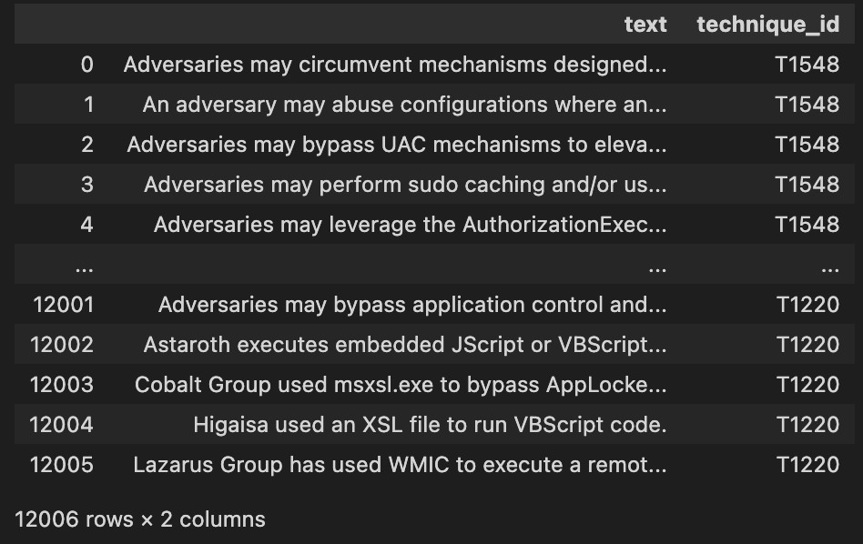

# MITRE ATT&CK Technique and Procedure Dataframe

This is a program that constructs some narratives and techniques together to facilitate data analysis.

If you think the project is helpful to you, welcome to my website [Sectools.tw](https://sectools.tw).

The data is from [attack.mitre.org](https://attack.mitre.org).

## How to use

If you want to recrawl the data on the website, just run [main.ipynb](main.ipynb) directly.

> Remember run below code.

```
pip3 install -r requirements.txt
```

Or you want to directly use the pkl file that has not been sorted out.
The format is 
```
{"TECHNIQUE_ID":["TEXT1","TEXT2"] }
```

Then type in your IDE

```
import pickle
with open("techniques.pkl","rb") as f:
    techniques = pickle.load(f)
```

Also you can use dataframe.

```
import pandas as pd
pd.read_excel("techniques.xlsx")
```

## Preview





